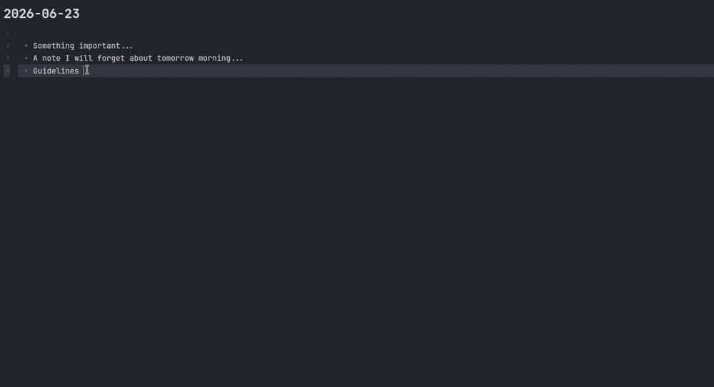

# Insert Path (Plugin)

  &nbsp;
  &nbsp;
  &nbsp;
  

  

Fuzzy-find any file or directory anywhere under a root (default: your home
folder) from inside Obsidian, preview it, and insert its path at the cursor.

## Why

For me, dropping a real filesystem path into a note normally means:

1. Open a terminal,
2. Fuzzy-find the directory,
3. Copy the path,
4. Switch back,
5. Paste.

Insert Path does the fuzzy-find in a modal and inserts the result where your cursor already is, a seamless user experience.
It brings the muscle memory of shell fuzzy finders into the editor, without leaving Obsidian.

## Features

- **Two commands**: _Insert directory path_ and _Insert file path_. (+ a `Tab` toggle to switch mode inside the picker)
- **Live fuzzy match** with highlighted match positions and a moving selection.
- **Preview pane**: a 2-level directory tree, or the head of a file.
- **Root switching** (`Ctrl/Cmd+O`): jump to home, the vault root, a recent root (the last 5 are remembered), or type/paste a custom path.
- **Configurable insertion**: a template decides what gets inserted.

On top of that, it has **no external dependencies**, no `fzf`, `eza`, `bat`, or `fd` binaries.
Walking and previews use Node's `fs`; fuzzy matching uses [fzf-for-js](https://github.com/ajitid/fzf-for-js), bundled into the plugin.

## Usage

1. Place your cursor in a note.
2. Run **Insert Path: Insert directory path** (or **…file path**) from the
   command palette, or bind a hotkey under **Settings → Hotkeys**. (If you use
   the [Doubleshift](https://github.com/Qwyntex/doubleshift) plugin, you can map
   shift-shift to either command.)
3. Type to filter; the preview updates as you move the selection.
4. Press **Enter** to insert the path at the cursor.

| Key          | Action                          |
| ------------ | ------------------------------- |
| `↑` / `↓`    | Move selection                  |
| `Ctrl+N/P`   | Move selection (readline-style) |
| `Enter`      | Insert the selected path        |
| `Tab`        | Toggle directory / file mode    |
| `Ctrl/Cmd+O` | Change the search root          |
| `Esc`        | Close                           |

## Settings

| Setting            | Default                      | Notes                                                                 |
| ------------------ | ---------------------------- | --------------------------------------------------------------------- |
| Default root       | your home folder             | Where the picker starts.                                              |
| Insertion template | `{path}`                     | Tokens: `{path}` (absolute), `{name}` (basename), `{rel}` (relative). |
| Skip directories   | `.git, node_modules, .cache` | Comma-separated directory names pruned while walking.                 |
| Follow symlinks    | on                           | Symlink cycles are handled safely.                                    |
| Include hidden     | on                           | Include dot-files and dot-directories.                                |
| Max results        | `10000`                      | A notice appears if the walk is truncated.                            |

**Insertion template examples**

Below are some examples of how the insertion template works:

| Template           | Inserts                           |
| ------------------ | --------------------------------- |
| `{path}`           | `/home/you/projects/docs`         |
| `` `{path}` ``     | `` `/home/you/projects/docs` ``   |
| `[{name}]({path})` | `[docs](/home/you/projects/docs)` |

So if you want to insert a Markdown link to the selected file, you can use `[{name}]({path})` as the template.

## Limitations

- Desktop only (Obsidian ≥ 1.4.0).
- The file preview is plain monospace text (no syntax highlighting).
- The commands require an active editor — they insert at the cursor.
- Tested with Ubuntu & macOS only.

## Development

See [CONTRIBUTING.md](docs/CONTRIBUTING.md) for the dev environment, the vault live-reload
workflow, and how to run the tests.

## License

See [MIT](LICENSE) licence.
