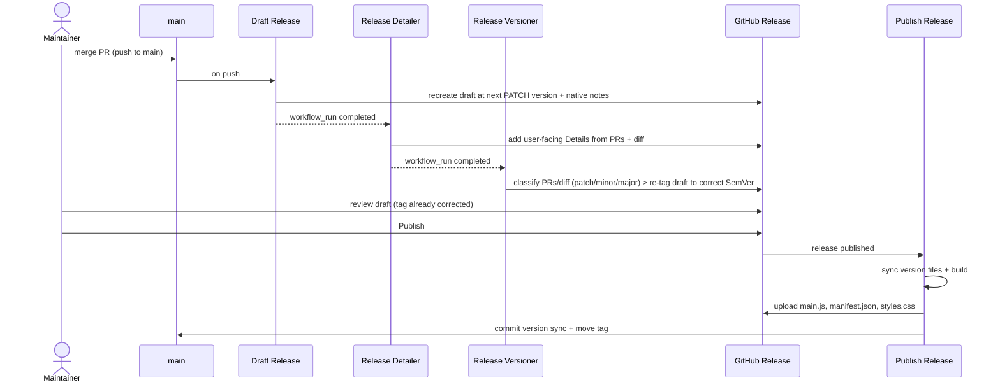

# Releasing

Releases are automated. You merge to `main`, review an auto-drafted release that AI
agents have enriched _and_ SemVer-stamped, and click **Publish** — everything else
(version selection, sync, build, asset upload, commit-back) happens for you.

## Lifecycle



1. **Draft Release** (`.github/workflows/draft-release.yml`, on every push to `main`)
   computes a **provisional** next version and recreates a single **draft** release
   tagged at that version, with GitHub's native auto-generated notes (grouped by PR
   label via `.github/release.yml`).
    - Provisional version = latest semver tag with its **patch** incremented; if there
      are no tags yet, the first release is whatever `package.json` declares. This is a
      baseline only — _Release Versioner_ (step 3) corrects it to the right SemVer bump.
    - Tags are **not** `v`-prefixed (e.g. `0.1.1`) so they equal `manifest.json` — the
      Obsidian community store and BRAT require the tag to match the plugin version.

2. **Release Detailer** (`.github/workflows/release-detailer.yml`) runs when _Draft
   Release_ completes. It uses [`anthropics/claude-code-action`](https://github.com/anthropics/claude-code-action):
   Claude reads the PRs and diff in the release range and inserts a user-facing
   `### :bulb: Details` section into the draft, leaving the native `## What's Changed`
   and `**Full Changelog**` lines untouched.

3. **Release Versioner** (`.github/workflows/release-versioner.yml`, also
   `claude-code-action`) runs when _Release Detailer_ completes. Claude reads the same
   PRs/diff and decides — per [SemVer](https://semver.org/spec/v0.1.0.html) — whether the
   release is a **patch**, **minor**, or **major (breaking)** change, then re-tags the
   **draft** to the correct version (recomputed from the latest **published** release) and
   fixes the `**Full Changelog**` compare link — so the draft already carries the right
   version before you see it.
    - **Bump → version:** `major` → `1.0.0`, `minor` → `0.2.0`, `patch` → `0.1.4` (from
      the latest published tag). Re-tagging uses `gh release edit --tag`, which keeps the
      same release object, so the enriched body and attached assets (e.g. the SBOM) are
      preserved. It **only ever edits a draft** — never a published release.
    - **Pre-1.0 note:** a `major` decision while still `0.y.z` jumps to `1.0.0`. To keep
      breaking changes inside `0.x` instead, adjust the mapping in the workflow's `prompt`.
    - Run it by hand from the **Actions** tab (workflow_dispatch) with `dry_run=true` to
      log the decision without editing, or a specific `tag`.

4. **You review** the draft in the GitHub Releases UI — the tag is **already corrected**
   to the right SemVer version. Sanity-check it (and the Details), then publish; override
   the tag by hand only if you disagree with the classification.

5. **Publish Release** (`.github/workflows/publish-release.yml`, on `release: published`):
    - syncs `package.json` → `manifest.json` + `versions.json` to the published version
      (via `version-bump.mjs`),
    - builds and attaches `main.js`, `manifest.json`, `styles.css` to the release,
    - commits the synced version back to `main` (`chore(release): <version> [skip ci]`)
      so `manifest.json` on `main` always equals the latest release, and
    - moves the tag onto that commit.

    This sync-back is what avoids version conflicts: `main` never lags behind the tags,
    so the next draft computes cleanly and the community store sees a matching manifest.

## Provenance & verifying release assets

**Publish Release** attests the build provenance of the release binaries with
[`actions/attest-build-provenance`](https://github.com/actions/attest-build-provenance): it
records a signed attestation binding `main.js`, `manifest.json`, and `styles.css` to the
workflow run and commit that produced them. Anyone can verify a downloaded asset came from
this repository's CI (and was not tampered with) using the GitHub CLI:

```bash
gh attestation verify main.js --repo u-ways/obsidian-path-picker
```

The attestation is keyed by the file's SHA-256 digest, so it stays valid regardless of the
release tag, and it's stored in the repository's attestations rather than as a release asset.

## Version files

The version lives in **three** files kept in sync by `version-bump.mjs`:

| File            | Holds                                              |
| --------------- | -------------------------------------------------- |
| `package.json`  | the canonical version (the source the bump reads)  |
| `manifest.json` | the plugin version Obsidian reads                  |
| `versions.json` | a map of plugin version → minimum Obsidian version |

You don't edit these by hand for a release — the pipeline sets them from the published
tag. (`versions.json` alone is **not** the version; it's the version→minAppVersion map.)

## One-time setup

- **`CLAUDE_CODE_OAUTH_TOKEN`** (repo secret) — auth for the `claude-code-action` agents
  (Release Detailer _and_ Release Versioner). Generate it from a **Claude Pro/Max
  subscription** (Copilot Free does **not** work) and store it as an Actions secret:
    ```bash
    claude setup-token   # authorise in the browser; copy the long-lived OAuth token
    gh secret set CLAUDE_CODE_OAUTH_TOKEN --repo u-ways/obsidian-path-picker
    ```
    Without it, the draft is still created with native notes at the provisional patch
    version; only the AI `:bulb: Details` enrichment and the automatic SemVer re-tagging are
    skipped (you write Details / re-tag by hand). Alternatives — a direct `ANTHROPIC_API_KEY`
    or Anthropic Workload Identity Federation — are in the
    [action's setup guide](https://github.com/anthropics/claude-code-action/blob/main/docs/setup.md).
- **`RELEASE_AUTOMATION_TOKEN`** (repo secret) — needed because `main` has **required
  status checks** (this would also apply to _Require a pull request before merging_) that
  the built-in `github-actions[bot]` can't bypass on this user-owned repo. The publish job
  pushes the version-sync commit with this PAT, which is attributed to the admin owner and
  so bypasses the ruleset via its `RepositoryRole` admin bypass; without it the push falls
  back to `GITHUB_TOKEN` and the required checks block it. (An org-owned repo could instead
  bypass for the GitHub Actions app and drop the PAT.)
- **Actions permissions** — the workflows declare `contents: write` per job, so the default
  token suffices for drafting and uploading release assets; only the version-sync push-back
  to `main` needs the PAT above (because of the required checks).

## Editing the agents

`release-detailer.yml` and `release-versioner.yml` are plain GitHub Actions workflows —
to change what Claude does, edit the `prompt:` (and `claude_args:`) in each directly.
There's no compile or lock step. `actionlint` catches workflow/YAML mistakes.

## Release-notes categories

`.github/release.yml` groups PRs in the native notes by label: `enhancement`/`feature`
→ ✨ Features, `bug`/`fix` → 🐛 Fixes, `dependencies` → ⬆️ Dependencies, everything else
→ 🔧 Changed. Label your PRs to control the changelog.
