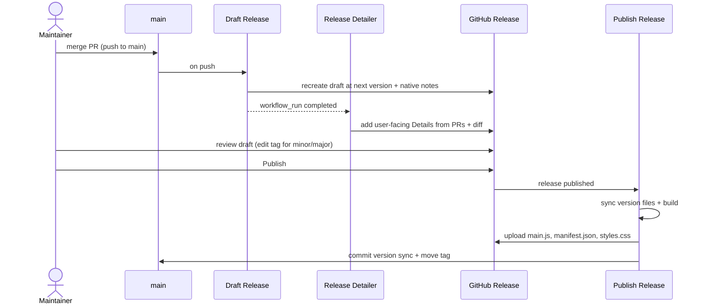

# Releasing

Releases are automated. You merge to `main`, review an auto-drafted release that an
AI agent has enriched, and click **Publish** — everything else (version sync, build,
asset upload, commit-back) happens for you.

## Lifecycle



1. **Draft Release** (`.github/workflows/draft-release.yml`, on every push to `main`)
   computes the next version and recreates a single **draft** release tagged at that
   version, with GitHub's native auto-generated notes (grouped by PR label via
   `.github/release.yml`).
    - Next version = latest semver tag with its **patch** incremented; if there are no
      tags yet, the first release is whatever `package.json` declares.
    - Tags are **not** `v`-prefixed (e.g. `0.1.1`) so they equal `manifest.json` — the
      Obsidian community store and BRAT require the tag to match the plugin version.

2. **Release Detailer** (`.github/workflows/release-detailer.md` → `.lock.yml`, a
   [gh-aw](https://github.com/github/gh-aw) agentic workflow) runs when _Draft Release_
   completes. A Copilot/Claude agent reads the PRs and diff in the release range and
   inserts a user-facing `### :bulb: Details` section into the draft, leaving the
   native `## What's Changed` and `**Full Changelog**` lines untouched.

3. **You review** the draft in the GitHub Releases UI. For a **patch** release, publish
   as-is. For a **minor/major** release, edit the draft's tag and title (e.g. `0.1.1` →
   `0.2.0`) before publishing.

4. **Publish Release** (`.github/workflows/publish-release.yml`, on `release: published`):
    - syncs `package.json` → `manifest.json` + `versions.json` to the published version
      (via `version-bump.mjs`),
    - builds and attaches `main.js`, `manifest.json`, `styles.css` to the release,
    - commits the synced version back to `main` (`chore(release): <version> [skip ci]`)
      so `manifest.json` on `main` always equals the latest release, and
    - moves the tag onto that commit.

    This sync-back is what avoids version conflicts: `main` never lags behind the tags,
    so the next draft computes cleanly and the community store sees a matching manifest.

## Provenance & verifying release assets

**Publish Release** attests the build provenance of the release binaries with
[`actions/attest-build-provenance`](https://github.com/actions/attest-build-provenance): it
records a signed attestation binding `main.js`, `manifest.json`, and `styles.css` to the
workflow run and commit that produced them. Anyone can verify a downloaded asset came from
this repository's CI (and was not tampered with) using the GitHub CLI:

```bash
gh attestation verify main.js --repo u-ways/obsidian-insert-path
```

The attestation is keyed by the file's SHA-256 digest, so it stays valid regardless of the
release tag, and it's stored in the repository's attestations rather than as a release asset.

## Version files

The version lives in **three** files kept in sync by `version-bump.mjs`:

| File            | Holds                                              |
| --------------- | -------------------------------------------------- |
| `package.json`  | the canonical version (the source the bump reads)  |
| `manifest.json` | the plugin version Obsidian reads                  |
| `versions.json` | a map of plugin version → minimum Obsidian version |

You don't edit these by hand for a release — the pipeline sets them from the published
tag. (`versions.json` alone is **not** the version; it's the version→minAppVersion map.)

## One-time setup

- **`COPILOT_GITHUB_TOKEN`** (repo secret) — required for the Release Detailer agent on
  this repo (a token from a Copilot-licensed identity). Without it the draft is still
  created with native notes; only the AI `:bulb: Details` enrichment is skipped.
    - **No-PAT alternative (organisation repos only):** since
      [2026-06-11](https://github.blog/changelog/2026-06-11-agentic-workflows-no-longer-need-a-personal-access-token/)
      an **org-owned** repo can drop the PAT by setting `permissions: { copilot-requests: write }`
      in `release-detailer.md` (then recompile) — AI credits bill to the org, which must have
      centralised Copilot billing and the "Allow use of Copilot CLI billed to the organization"
      policy enabled. This repo is under a **user** account, so it uses the PAT above; transfer
      it to such an org to switch.
- **`RELEASE_AUTOMATION_TOKEN`** (repo secret) — needed because `main` has **required
  status checks** (this would also apply to _Require a pull request before merging_) that
  the built-in `github-actions[bot]` can't bypass on this user-owned repo. The publish job
  pushes the version-sync commit with this PAT, which is attributed to the admin owner and
  so bypasses the ruleset via its `RepositoryRole` admin bypass; without it the push falls
  back to `GITHUB_TOKEN` and the required checks block it. (An org-owned repo could instead
  bypass for the GitHub Actions app and drop the PAT.)
- **Actions permissions** — the workflows declare `contents: write` per job, so the default
  token suffices for drafting and uploading release assets; only the version-sync push-back
  to `main` needs the PAT above (because of the required checks).

## Editing the agent

`release-detailer.lock.yml` is generated — never edit it by hand. Change
`release-detailer.md`, then recompile and commit **both** files:

```bash
gh extension install github/gh-aw   # once
gh aw compile release-detailer
git add .github/workflows/release-detailer.md .github/workflows/release-detailer.lock.yml
```

## Release-notes categories

`.github/release.yml` groups PRs in the native notes by label: `enhancement`/`feature`
→ ✨ Features, `bug`/`fix` → 🐛 Fixes, `dependencies` → ⬆️ Dependencies, everything else
→ 🔧 Changed. Label your PRs to control the changelog.
